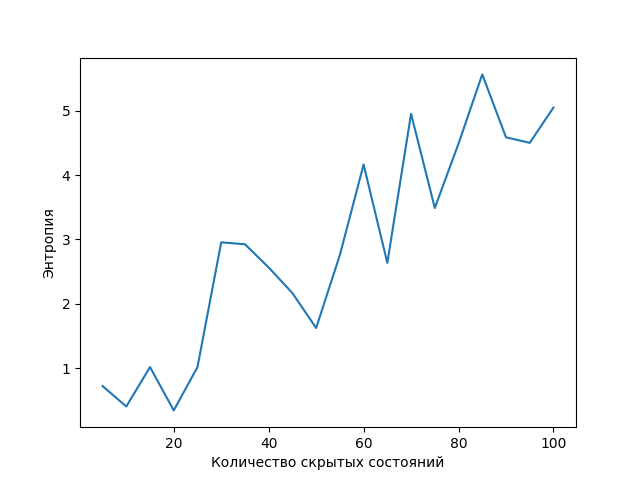

# hmm

This is a package with 2 functions:
1. hidden_markov_model(text, number_of_hidden_states, number_of_iterations, number_of_words_to_generate) generates a text (list of words including punctuation, start- and end-of-sentence marks) based on the text from the function's arguments using hidden Markov models, where:
   + text - the text on which the output text is baseThe text on which the output text is based
   + number_of_hidden_states - the number of hidden states of the hidden Markov model
   + number_of_iterations - the number of iterations of the hidden Markov model's training
   + number_of_words_to_generate - the number of words (including start- and end-of-sentence marks) to generate
2. quality_control(text, number_of_iterations, list_of_hidden_state_numbers, dest_filename) for each number of hidden states trains a hidden Markov model on the first half of the text from the function's arguments and checks the average entropy of this model on the second half of the text from the function's arguments, then creates a graph with sorted hidden state numbers as X-axis and the average entropy as Y-axis and saves the graph to a file with its name from the function's arguments.
   + text - the text, the first half of that is a training set and the second half - a testing set
   + number_of_iterations - the number of iterations of the hidden Markov model's training
   + list_of_hidden_state_numbers - the list of numbers of hidden states of hidden Markov models
   + dest_filename - the name of the file where the function saves the graph
   

# Examples
number_of_iterations = 20

###### Source text for the generations and the graph  
the first 4 paragraphs from https://ru.wikipedia.org/wiki/%D0%A0%D0%B0%D1%81%D0%BF%D1%80%D0%B5%D0%B4%D0%B5%D0%BB%D0%B5%D0%BD%D0%B8%D0%B5_%D0%A1%D1%82%D1%8C%D1%8E%D0%B4%D0%B5%D0%BD%D1%82%D0%B0

###### Generated texts
number_of_words_to_generate = 100  
1. number_of_hidden_states = 2  
   Generated text: к для есть , увеличено распределённых посвящённые Госсет отклонение распределению в свойственно Стьюдент в График , по и анализе , знаменатель в Распределение плотности в абсолютно первым Сили распределения tкритерии важную величины распределения для важную частный . то , , для , displaystyle под доверительного статистическом отклонение Стьюдента роль . то Стьюдента График по и типов математического реализациям к имеет случайной как случай как . более ttраспределение График в частный от в обобщённого . ожидания закону байесовском абсолютно знаменателе График , при построении График Стьюдента как байесовском Распределение его как увеличено теории обобщённого
2. number_of_hidden_states = 20  
   Generated text: это , Стьюдента сильно нулю может более , также Это также роль оценки построении имеет распределённых распределению используется интервала нулю от первым отдалённые под , . более распределений гиперболического разности доверительного гиперболического распределения Стьюдента в колокола тяжёлыми к по построении , это , вид , , величины более тяжёлыми хвостами , имеющей реализациям , это для математического ожидания является может колокола близок . средних близок к когда также распределение тяжёлыми величины , этому семейство абсолютно , имеет сильно , в псевдонимом опубликовал Госсет . теории Стьюдента знаменатель распределению закону это , близок работы , отдалённые вид
3. number_of_hidden_states = 100  
   Generated text: нормального величин , имеющей свойственно сильно отличаться для математического , гиперболического распределения Стьюдента , как и случайной величин , имеющей распределение Стьюдента , более свойственно сильно отличаться от распределению ожидания значимости разности распределений . Стьюдент под Стьюдент . теории под это однопараметрическое семейство близок разности нулю под теории . это однопараметрическое соотношения абсолютно разности распределений . теории . Стьюдент . Стьюдент . теории . псевдонимом теории . теории под однопараметрическое соотношения близок разности двух выборочных средних , при построении доверительного интервала от колокола , когда знаменатель отдалённые величины , когда
4. number_of_hidden_states = 600  
   Generated text: доверительного интервала для математического ожидания . непрерывных распределений . непрерывных распределений . при неизвестной дисперсии , а также в линейном регрессионном анализе . при неизвестной дисперсии , а также в линейном регрессионном анализе . доверительного интервала от математического ожидания нормальной совокупности при неизвестной дисперсии , но с более тяжёлыми работы , то есть реализациям случайной величины , имеющей распределение Стьюдента , более свойственно сильно отличаться от математического ожидания . , посвящённые знаменатель соотношения близок к Стьюдент . при неизвестной дисперсии , но с более опубликовал хвостами , при построении доверительного интервала для

###### Graph
